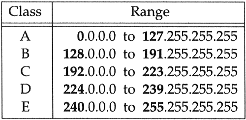

## การแบ่ง IP Address แบบ Classful Addressing

การแบ่ง IP Address แบบเดิม (Classful Addressing) เป็นสิ่งที่ใช้ก่อนที่ Subnet Mask จะถูกนำมาใช้อย่างแพร่หลาย เพื่อจัดการการกำหนดที่อยู่ IP อย่างมีประสิทธิภาพมากขึ้น แต่ละ Class ของ IP มีขอบเขตการแบ่ง Network ID และ Host ID ตายตัว:

   #### Classful Addressing: การแบ่งแบบดั้งเดิมของ IP Address

   IP Address ถูกแบ่งออกเป็น 5 Class ตามขนาดของ Network ID และ Host ID ได้แก่ **Class A, B, C, D, และ E** แต่ที่ใช้สำหรับเครือข่ายทั่วไปคือ Class A, B, และ C:

   1. **Class A**:
      - IP Address: เริ่มต้นด้วย 0-127 ใน Octet แรก
      - Network ID: 8 บิตแรก
      - Host ID: 24 บิตหลัง
      - เหมาะสำหรับเครือข่ายขนาดใหญ่ เช่นองค์กรขนาดใหญ่หรือรัฐบาล
      - ตัวอย่าง:  **10.0.0.1**

   2. **Class B**:
      - IP Address: เริ่มต้นด้วย 128-191 ใน Octet แรก
      - Network ID: 16 บิตแรก
      - Host ID: 16 บิตหลัง
      - เหมาะสำหรับองค์กรขนาดกลาง
      - ตัวอย่าง:  **172.16.0.1**

   3. **Class C**:
      - IP Address: เริ่มต้นด้วย 192-223 ใน Octet แรก
      - Network ID: 24 บิตแรก
      - Host ID: 8 บิตหลัง
      - เหมาะสำหรับเครือข่ายขนาดเล็ก เช่นในองค์กรหรือบ้าน
      - ตัวอย่าง:  **192.168.1.1**

   4. **Class D (Multicast)**:
      - IP Address: เริ่มต้นด้วย 224-239
      - ใช้สำหรับการสื่อสารแบบ Multicast

   5. **Class E (Reserved)**:
      - IP Address: เริ่มต้นด้วย 240-255
      - ใช้สำหรับการวิจัยและการทดลอง

   #### ข้อจำกัดของ Classful Addressing

   การกำหนดขอบเขต Network ID และ Host ID แบบคงที่ทำให้การใช้งาน IP Address ไม่ยืดหยุ่น ซึ่งนำไปสู่การใช้งาน Subnet Mask เพื่อปรับให้การจัดการเครือข่ายมีความยืดหยุ่นมากขึ้น

## References

- Kurose, J. F., & Ross, K. W. (2017). Computer Networking: A Top-Down Approach (7th ed.). Pearson Education.
- Tanenbaum, A. S. (2010). Computer Networks (5th ed.). Prentice Hall.