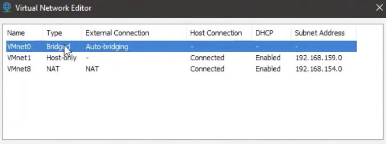

# วิธีในการลง Ubuntu Server บน VMware

ให้ทำการ Download Ubuntu Server ISO มาก่อน
ได้ที่ [Ubuntu Server](https://ubuntu.com/download/server)

### 1. เปิด VMware แล้วเลือก ISO ของ Ubuntu Server ที่โหลดมา ให้ทำการตั้งค่า VM เป็นไปตามดังนี้

**CPU :** 2 core  
**RAM :** 2 GB  
**Storage :** 15 GB  
**Network Adapter :** ให้เลือกเป็น NAT ไว้ก่อน

### 2. ให้ทำการตั้งค่าเบื้องต้นสำหรับเครื่อง Server เช่น Keyboard Layout, type of installation

**Network Configuration และ Proxy Configuration ให้ข้ามขั้นตอนตรงนี้ไป**

### 3. รอให้เครื่อง Server ทำหาร test ให้เสร็จ จากนั้น Storage Configuration ให้เลือกเป็น Entire Disk แล้ว Continue ต่อไปเรื่อย ๆ

### 4. หลังจากเสร็จแล้วจะขึ้นหน้าต่างให้ตั้งค่าชื่อ และ password ต่าง ๆ สามารถตั้งได้ตามใจชอบ

### 5. ให้ Skip Ubuntu Pro แล้วติ๊กลง OpenSSH ไว้ด้วย และ Featured Server snaps สามารถข้ามไปก่อนได้

### 6. รอลงให้เสร็จจากนั้น Reboot จึงสามารถใช้งานได้

## วิธีทำให้ VM เชื่อม เน็ตของเครื่อง Local ได้ให้ตั้งค่าที่ Edit > Virtual Network Editor > Change Setting

จากนั้นให้ทำการเลือก NIC (Network Interface Card) ที่ต้องการใช้ จากนั้นจึงกด Restart เครื่อง VM จึงเสร็จสมบูรณ์

Shell script เอาไว้ Login Network คณะ: [login.sh](Files/login.sh)

# ลิงก์วิดีโอสำหรับศึกษาเพิ่มเติม

- [How to Run an Ubuntu Server VM with VirtualBox (and login via SSH)](https://youtu.be/wqm_DXh0PlQ?si=Z0rwmR4-Vhp18Aik)
- [How to install and run Nginx web server in Ubuntu Server 22.04](https://youtu.be/nxvNSPyhMOE?si=qu7N7shz0x28mRO2)
